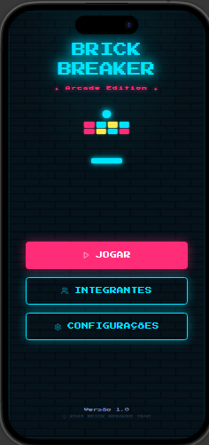
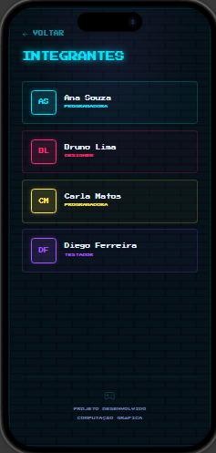
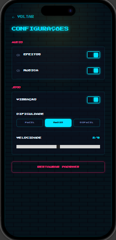
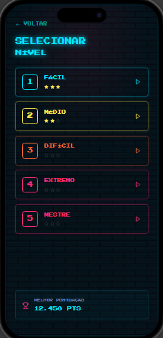
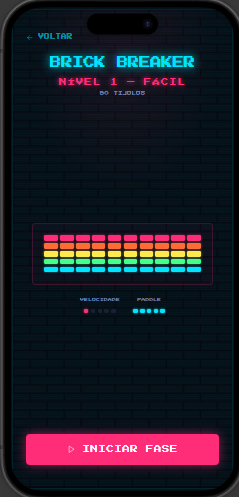
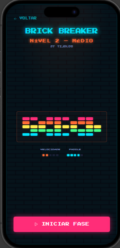
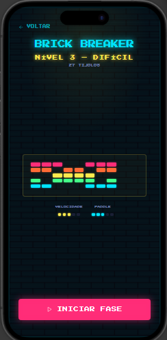
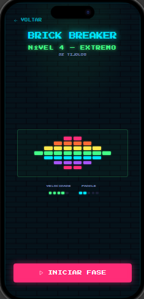
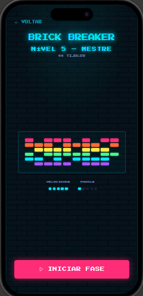
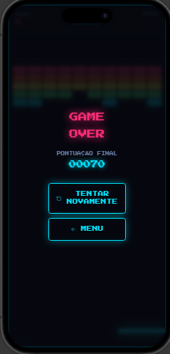

# 🎮 Wireframes do Projeto

> Documentação visual das telas do projeto.

## 📋 Índice

- [1. Tela Inicial](#1-tela-inicial)
- [2. Tela de Integrantes](#2-tela-de-integrantes)
- [3. Tela de Configurações](#3-tela-de-configurações)
- [4. Tela de Níveis](#4-tela-de-níveis)
- [5. Tela Nível 1](#5-tela-nível-1)
- [6. Tela Nível 2](#6-tela-nível-2)
- [7. Tela Nível 3](#7-tela-nível-3)
- [8. Tela Nível 4](#8-tela-nível-4)
- [9. Tela Nível 5](#9-tela-nível-5)
- [10. Tela Game Over](#10-tela-game-over)

---

## 🖥️ Telas

### 1. Tela Inicial



---

### 2. Tela de Integrantes



---

### 3. Tela de Configurações



---

### 4. Tela de Níveis



---

### 5. Tela Nível 1



---

### 6. Tela Nível 2



---

### 7. Tela Nível 3



---

### 8. Tela Nível 4



---

### 9. Tela Nível 5



---

### 10. Tela Game Over



---

## 📁 Estrutura do projeto

```text
.
├── README.md
└── imagens/
    ├── 01-tela-inicial.png
    ├── 02-tela-integrantes.png
    ├── 03-tela-configuracoes.png
    ├── 04-tela-de-niveis.png
    ├── 05-tela-nivel-1.png
    ├── 06-tela-nivel-2.png
    ├── 07-tela-nivel-3.png
    ├── 08-tela-nivel-4.png
    ├── 09-tela-nivel-5.png
    └── 10-tela-game-over.png
```

> **Observação:** as imagens são referenciadas por caminhos relativos (`./imagens/...`), portanto serão renderizadas diretamente pelo GitHub quando o `README.md` e a pasta `imagens` forem enviados para o mesmo repositório.
